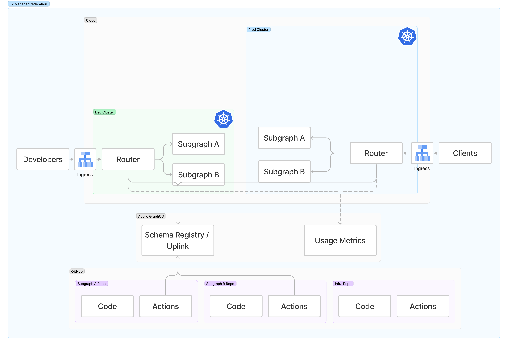

# 02 - Managed federation

⏱ Estimated time: 5 minutes

## What you'll build



## Part A: Publish subgraph schemas to Apollo GraphOS

In both **subgraph-a** and **subgraph-b** repositories:

- Edit `.github/workflows/Merge to Main.yml`
- Add a new job to the bottom of the file:
  ```yaml
  publish:
    needs: [deploy_aws, deploy_gcp]
    if: always() &&
      (needs.deploy_aws.result == 'success' || needs.deploy_aws.result == 'skipped') &&
      (needs.deploy_gcp.result == 'success' || needs.deploy_gcp.result == 'skipped')
    uses: ./.github/workflows/_rover-subgraph-publish.yml
    secrets: inherit
    with:
      subgraph_name: subgraph-a # change to subgraph-b in that repo
      variant: dev
  ```
- After merging the code to the `main` branch, the `Merge to Main` action will build the docker container, deploy the subgraph application, and finally publish the subgraph schema to Apollo GraphOS.
- Visit your graph in GraphOS Studio to see that the subgraph schemas published successfully and it built a new supergraph schema for the `dev` variant.
- Add a new job to `.github/workflows/Manual Deploy.yml`:
  ```yaml
  publish:
    needs: [deploy_aws, deploy_gcp]
    if: always() &&
      (needs.deploy_aws.result == 'success' || needs.deploy_aws.result == 'skipped') &&
      (needs.deploy_gcp.result == 'success' || needs.deploy_gcp.result == 'skipped')
    uses: ./.github/workflows/_rover-subgraph-publish.yml
    secrets: inherit
    with:
      subgraph_name: subgraph-a # change to subgraph-b in that repo
      variant: ${{ inputs.environment }}
  ```
- After merging this change to main, trigger the `Manual Deploy` action to deploy and publish to production:

  ```sh
    gh workflow run "Manual Deploy" --repo $GITHUB_ORG/apollo-supergraph-k8s-subgraph-a \
      -f version=main \
      -f environment=prod \
      -f dry-run=false \
      -f debug=false

    gh workflow run "Manual Deploy" --repo $GITHUB_ORG/apollo-supergraph-k8s-subgraph-b \
      -f version=main \
      -f environment=prod \
      -f dry-run=false \
      -f debug=false
  ```

- Visit your graph in GraphOS Studio to see that the subgraph schemas published successfully and it built a new supergraph schema for the `prod` variant.

## Part B: Deploy Apollo Router

Now that the supergraph schema is available via Apollo Uplink, you can deploy the router:

```
gh workflow run "Deploy Router" --repo $GITHUB_ORG/apollo-supergraph-k8s-infra \
  -f environment=dev \
  -f dry-run=false \
  -f debug=false

gh workflow run "Deploy Router" --repo $GITHUB_ORG/apollo-supergraph-k8s-infra \
  -f environment=prod \
  -f dry-run=false \
  -f debug=false
```

Lastly, make a GraphQL request to the router via its IP address. Follow the below instructions for your cloud provider you are using. 

### <image src="../images/gcp.svg" height="13" style="margin:auto;" /> GCP

```sh
kubectx apollo-supergraph-k8s-prod
ROUTER_IP=$(kubectl get ingress -n router -o jsonpath="{.*.*.status.loadBalancer.ingress.*.ip}")
open http://$ROUTER_IP
```

Upon running the above commands, you'll have the Router page open and you can make requests against your newly deployed supergraph! 

### <image src="../images/aws.svg" height="13" style="margin:auto;" /> AWS

```sh
kubectx apollo-supergraph-k8s-prod
ROUTER_HOSTNAME=$(kubectl get ingress -n router -o jsonpath="{.*.*.status.loadBalancer.ingress.*.hostname}")
open http://$ROUTER_HOSTNAME
```

Upon running the above commands, you'll have the Router page open and you can make requests against your newly deployed supergraph! 

**NOTE:** You may need to wait 5-10 minutes for the AWS load balancer to be available. 

## Onward!

[Step 3: Schema Checks](../03-schema-checks/)
