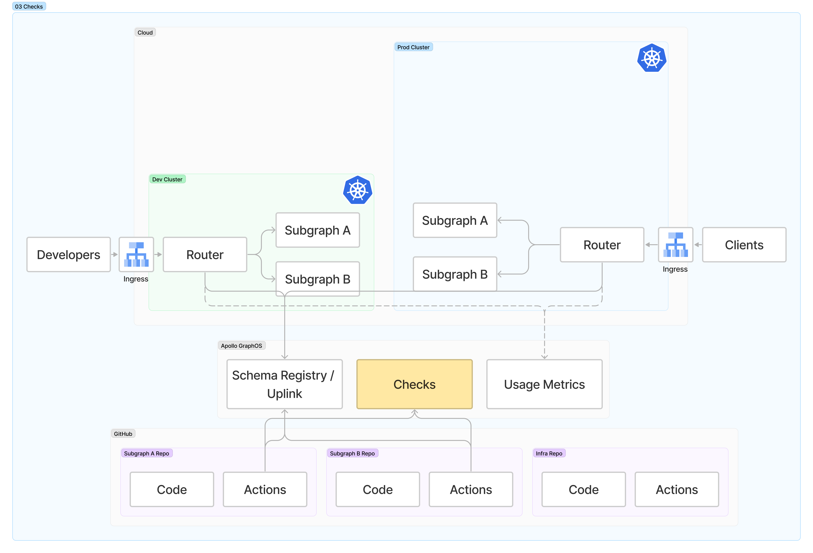

# 03 - Schema checks

⏱ Estimated time: 5 minutes

## What you'll build



## Part A: Schema checks on pull requests

In both **subgraph-a** and **subgraph-b** repositories:

- Edit `.github/workflows/Pull Request Check Code.yml`
- Add a new job to the bottom of the file:
  ```yaml
  checks:
    strategy:
      matrix:
        variant: [dev, prod]
    uses: ./.github/workflows/_rover-subgraph-check.yml
    secrets: inherit
    with:
      subgraph_name: subgraph-a # change to subgraph-b in that repo
      variant: ${{ matrix.variant }}
  ```

- Optional: install the Apollo Studio Github app to see Check status on PRs: https://github.com/marketplace/apollo-studio.

## Part B: Demonstrate a schema change

1. Make a schema change.
2. Open a Pull Request
3. Observe that the pull request check fails or succeeds.

## Onward!

[Step 4: Observability](../04-observability/)
