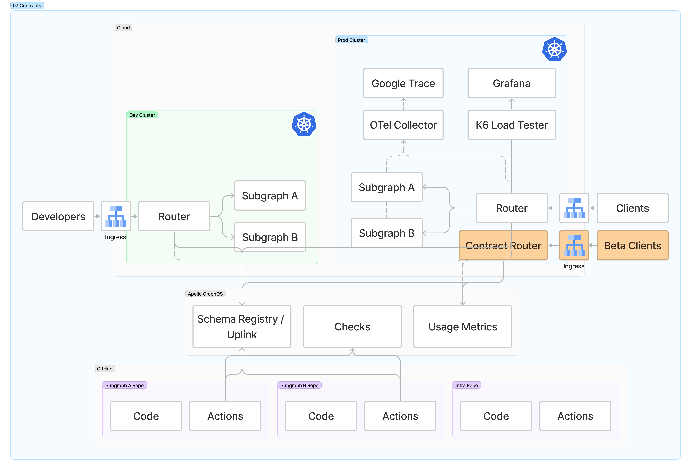

# 07 - Contracts

> Contracts are available only for Enterprise users

⏱ Estimated time: 5 minutes

## What you'll build



## Part A: Tag your subgraphs

Edit `src/schema.graphql` in either subgraph and add a tag to a field like so:

```graphql
# subgraph-a

type Location @key(fields: "id") {
  id: ID!
  name: String!
  description: String!
  photo: String! @tag(name: "beta")
}
```

Commit the change and the `Merge to Main` workflow will deploy and publish to `dev`. Trigger the `Manual Deploy` workflow to deploy and publish to `prod`.

## Part B: Create a contract variant

[Follow the documentation](https://www.apollographql.com/docs/graphos/delivery/contracts) to create a contract in GraphOS Studio.

For example, you could create a variant called "contract" with a filter that **excludes** elements tagged "beta".

## Part C: Deploy a contract router

The "Deploy Contract Router" workflow is nearly identical to the "Deploy Router GKE" workflow. The primary different is that it takes an additional `variant` input field.

```sh
gh workflow run "Deploy Contract Router" --repo $GITHUB_ORG/apollo-supergraph-k8s-infra \
  -f environment=dev \
  -f variant=contract \
  -f dry-run=false \
  -f debug=false

gh workflow run "Deploy Contract Router" --repo $GITHUB_ORG/apollo-supergraph-k8s-infra \
  -f environment=prod \
  -f variant=contract \
  -f dry-run=false \
  -f debug=false
```

After the deploy completes, you'll have a new ingress with a new IP address.

```
ROUTER_IP=$(kubectl get ingress -n contract-router -o jsonpath="{.*.*.status.loadBalancer.ingress.*.ip}")
open http://$ROUTER_IP
```
