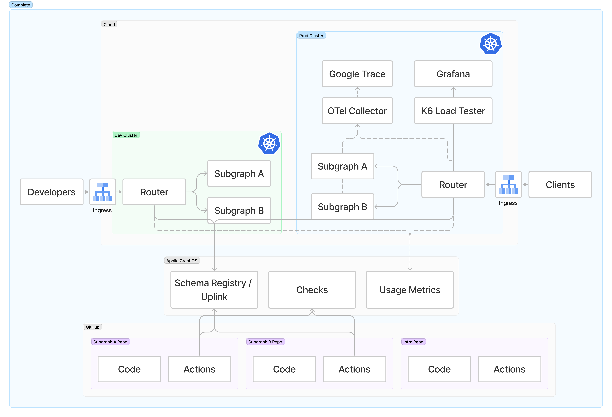
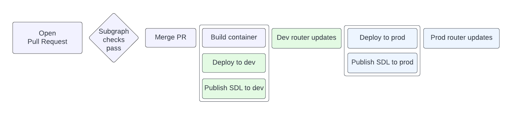

# Build a Supergraph

This repository contains the demos for the "Build a Supergraph" series. All you need to follow along is:

- A Github account
- An Apollo GraphOS account (free!)
- An account for either:
  - Google Cloud Platform (GCP) 
  - Amazon Web Services (AWS)

## What you'll build

### The ending Software Development Life Cycle (SLDC)

## Contents

- ⏱ estimated time: 1 hour 15 minutes
- 💰 estimated cost: $10

### [Step 1: Setup](/01-setup)

- Part A: Gather accounts and credentials
- Part B: Provision resources
- Part C: Deploy applications

### [Step 2: Managed federation](/02-managed-federation)

- Part A: Apollo Studio
- Part B: Publishing subgraphs
- Part C: Deploy Apollo Router

### [Step 3: Schema checks](/03-schema-checks)

- Part A: Schema checks on pull requests
- Part B: Demonstrate a schema change

### [Step 4: Observability](/04-observability)

- Part A: Setup Open Telemetry
- Part B: Demonstrate traces and metrics

### [Step 5: Load testing](/05-load-testing)

- Part A: Deploy load testing client
- Part B: Run load test and analyze results

### [Step 6: Cleanup](/06-cleanup)

- Part A: Automated cleanup

### [🌟 _Bonus_ 🌟 Step 7: Contracts](/07-contracts)

- Part A: Tag your subgraphs
- Part B: Create a contract variant
- Part C: Deploy a contract router
